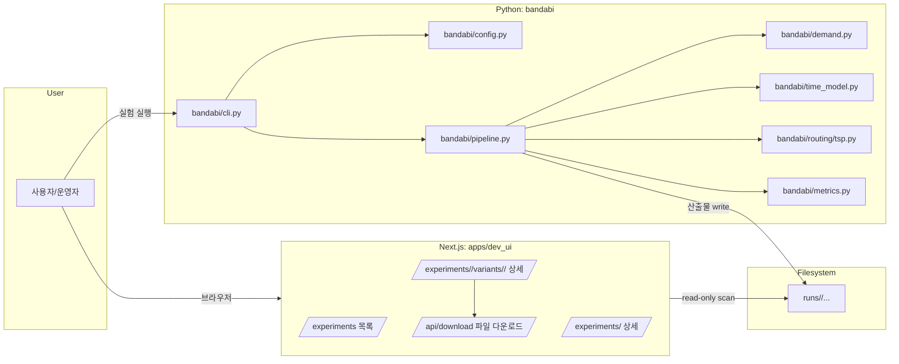
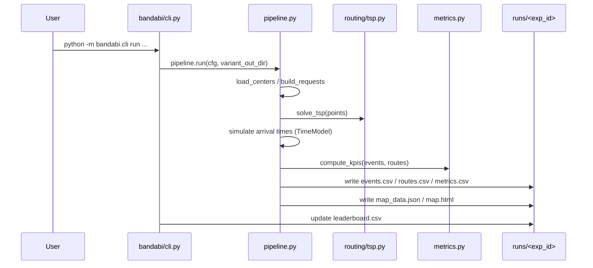

# Bandabi Flow (아키텍처 + 데이터 계약 + 실행 흐름)

이 문서는 **후대의 나(그리고 팀원)**가 "이 프로젝트가 어떻게 돌아가는지"를 10분 안에 복구할 수 있게 하려는 목적의 **실행 가능한 지도**다.

---

## 0) 한 줄 요약

- **Python 시뮬레이션/실험 파이프라인**이 `runs/<exp_id>/...`에 산출물을 떨어뜨리고
- **Dev UI(Next.js)**가 `runs/` 폴더를 스캔해서 `leaderboard.csv`/variant 산출물을 읽어 **탐색/다운로드/지도 시각화**까지 보여준다.

---

## 1) 전체 컴포넌트 지도



---

## 2) "OSMnx를 안 쓰면 지금 뭐로 도는가?"

현재 routing/time 계산은 **실도로 네트워크 기반(OSMnx)**이 아니라, 아래 방식이다.

1) **거리(근사)**
- 위·경도 좌표 간의 대략적인 거리 = **haversine(구면거리)**

2) **시간(근사)**
- 거리 / 속도 + 노이즈
- 실도로 우회, 신호, 회전, ...을 한방에 반영하기 위해 `detour_factor`(우회 계수)로 곱해 근사

3) **경로 최적화(근사)**
- 노드들(센터 + 픽업들)에 대해 **TSP 근사(Nearest Neighbor + 2-opt)**
- 비용함수는 `euclidean` 혹은 `time matrix` 기반

즉 지금은 "**지도 위 직선(또는 매우 단순한 시간모델)**"로 굴러가고, **실제 도로 네트워크 경로**는 아직 아니다.

---

## 3) Seed(재현성) 정책

현재 재현성(seed)은 두 군데가 핵심이다.

- `demand.seed`: 요청(예약) 생성 RNG seed
- `sim.rng_seed`: 시간 모델 노이즈 RNG seed

둘 다 고정하면 같은 config에서 같은 산출물이 나오게 설계(가능한 한)되어 있다.

---

## 4) 산출물 계약 (runs 폴더)

### 4.1 runs 폴더 구조

```
runs/
  <exp_id>/
    leaderboard.csv
    <variant_id>/
      config_resolved.yaml
      metrics.csv
      events.csv
      routes.csv
      map_data.json        # NEW: 지도 렌더용 요약
      map.html             # NEW: 브라우저로 바로 열리는 지도
```

### 4.2 각 파일 의미

- `leaderboard.csv`
  - variant별 KPI 요약 테이블 (Dev UI의 실험 상세 화면 기준)

- `config_resolved.yaml`
  - base + scenario + sweep override를 합친 **최종 실행 config**

- `metrics.csv`
  - KPI의 단일 row (리더보드에서 한 줄로도 보지만, variant 단위 산출물로도 보관)

- `events.csv`
  - 요청(예약) 단위 이벤트 로그
  - (NEW) 지도 재현을 위해 `pickup_lat/pickup_lon`, `center_lat/center_lon`, `stop_seq`, `node_idx` 등을 포함

- `routes.csv`
  - 차량 단위 route 요약
  - (NEW) `stops_json`: stop sequence + lat/lon이 들어있는 JSON string

- `map_data.json` / `map.html`
  - 육안 검증용 지도 산출물
  - Dev UI에서도 iframe으로 바로 확인 가능

---

## 5) 실행 흐름 (실험 1회)



---

## 6) Dev UI에서 읽는 규칙

Dev UI는 "DB"가 아니라 **파일 계약**을 믿고 동작한다.

- `/experiments`:
  - `runs/` 디렉토리 스캔 → 실험 목록
- `/experiments/<exp_id>`:
  - `runs/<exp_id>/leaderboard.csv` 읽어서 리더보드 표시
- `/experiments/<exp_id>/variants/<variant_id>`:
  - `runs/<exp_id>/<variant_id>/...` 산출물 프리뷰 + 다운로드 + 지도 iframe
- `/api/download`:
  - allowlist 파일만 제공 (경로 traversal 방지)

**성능 병목 제거 전략**
- 큰 파일을 UI에서 통째로 읽지 않는다.
  - preview는 head(최대 ~2MB/2000줄)만 로드
  - 전체 분석은 다운로드 후 로컬에서 (또는 별도 분석 탭/백엔드로 분리)

---

## 7) "트래픽"을 추가한다면? (정확한 용어 정리)

여기서 트래픽은 두 종류가 있다.

1) **도로 교통량(road traffic)**
- OSMnx/지도 기반 travel time에 반영되는 "차량 통행량" (혼잡도)
- 지금은 모델에 없다. 향후 `TimeModel`이 도로 혼잡도를 입력 피처로 받을 수 있다.

2) **서버 트래픽(web traffic)**
- 유저가 예약을 몰아서 넣을 때 발생하는 "요청 부하"
- 이건 routing과 다른 층의 문제다 (백엔드 아키텍처 문제)

### 7.1 서버 트래픽을 진지하게 넣는 아키텍처(추천)

- **API (FastAPI/NestJS)**
  - 예약 생성/조회
  - 인증/인가
  - idempotency key(중복 예약 방지)

- **Queue + Worker (Celery/RQ/BullMQ)**
  - "최적화 재계산"은 비싼 작업이므로 API 요청에서 바로 돌리지 말고 큐로 넘긴다.

- **Cache (Redis)**
  - 같은 입력(날짜/센터/타임슬롯)에 대한 최적화 결과 캐시
  - 대량 조회 시 DB 부하 완화

- **DB (Postgres)**
  - 예약/센터/차량/운행계획 스키마
  - 스냅샷(어떤 입력으로 어떤 결과가 나왔는지) 보존

이 방향은 "프로젝트"를 넘어서 "서비스"로 성장할 때 필수로 들어오는 길이다.

---

## 8) 지도 시각화 (최종 신뢰 확보용)

### 8.1 새 실험에서는 자동 생성
- variant 폴더에 `map.html`이 생성된다.
- 브라우저로 열면 차량별 폴리라인이 보인다.

### 8.2 기존 산출물에 대해 재생성

```
python scripts/render_route_map.py --exp <exp_id> --variant <variant_id>
```

(단, 아주 예전 runs에서 `events.csv`에 좌표가 없다면 재생성이 불가능하니, 그 경우는 새 코드로 rerun이 필요하다.)

---

## 9) OSMnx(실도로)로 갈 때의 최소 설계 가이드

- (1) `RoutingProvider` 인터페이스 도입
  - `distance_matrix(nodes)`, `time_matrix(nodes, profile)`
- (2) 구현체 2개
  - `ApproxProvider`(현재: haversine + detour)
  - `OsmnxProvider`(실도로 그래프 최단거리)
- (3) 캐싱
  - 센터/구 단위로 그래프 캐시
  - OD(Origin-Destination) 행렬은 memoization

이렇게 하면 실험 단계에서는 근사모델로 빠르게 돌리고, 최종 제출/운영에서는 OSMnx 기반으로 스위치가 가능하다.

